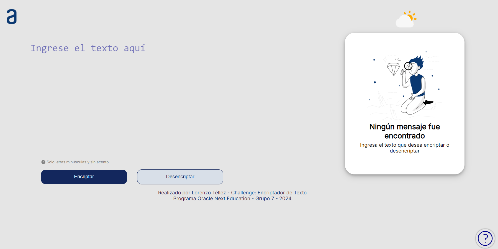

# 🚀 Encriptador Alura

---

## 📜 Descripción

Bienvenido al **Encriptador Alura**. Esta aplicación web es el resultado de nuestro desafío en el programa Oracle Next Education - Grupo 7, 2024. Diseñada para simplificar la encriptación y desencriptación de mensajes.

---

## 🛠️ Funcionalidades

- **🔒 Encriptar Mensaje**: Convierte tus mensajes en un código seguro.
- **🔓 Desencriptar Mensaje**: Recupera tus mensajes originales con facilidad.
- **📋 Copiar Texto**: ¡Solo un clic para copiar al portapapeles!
- **📱 Diseño Responsivo**: Se adapta perfectamente a cualquier dispositivo.

---

## 📸 Capturas de Pantalla
### **Inicio**

### **Pantalla Principal**

### **Desencriptando Mensaje Secreto**

---

## 💻 Tecnologías Utilizadas

- **HTML**: Estructura básica de la página.
- **CSS**: Estilos personalizados y diseño responsivo.
- **JavaScript**: Lógica para la encriptación y desencriptación.

